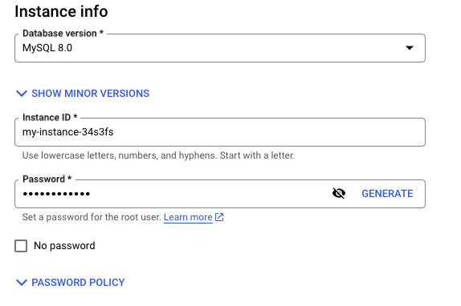
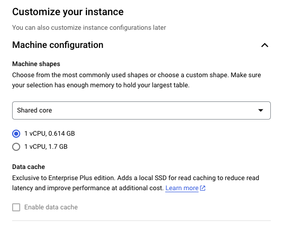
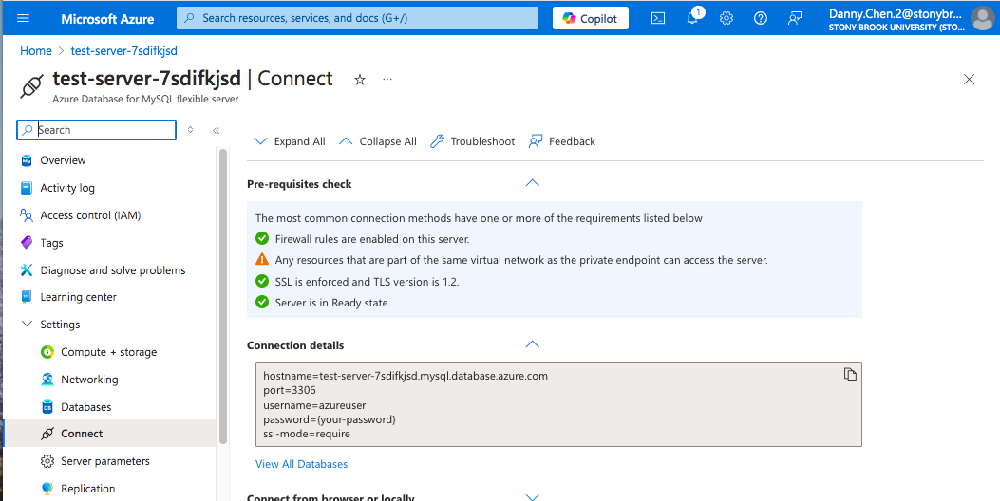
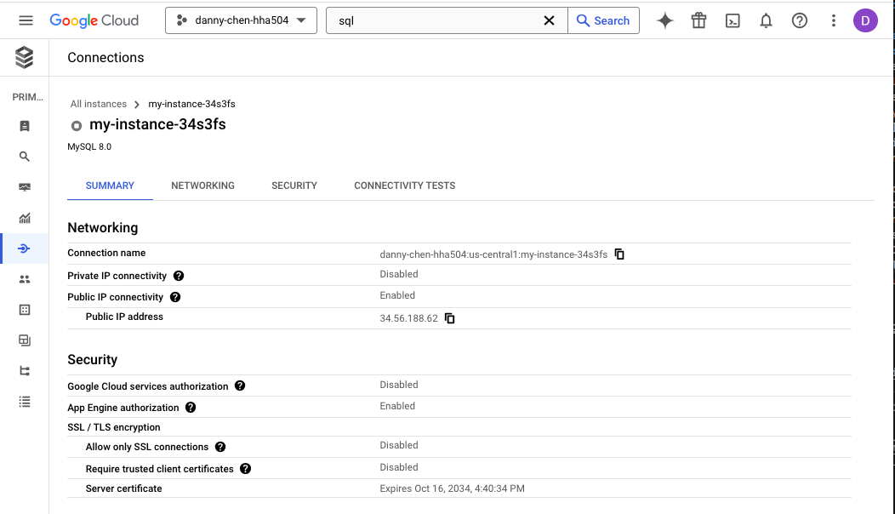
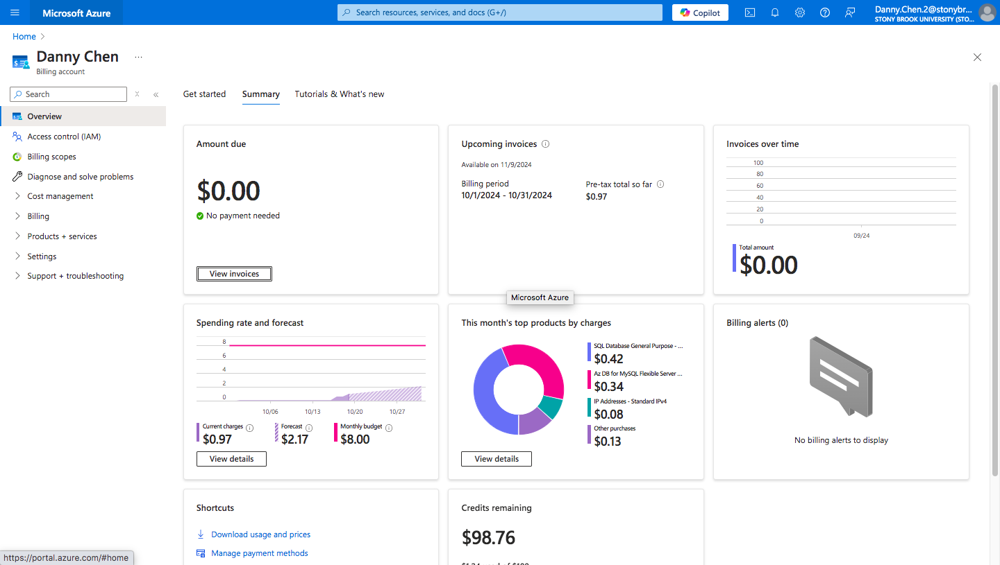
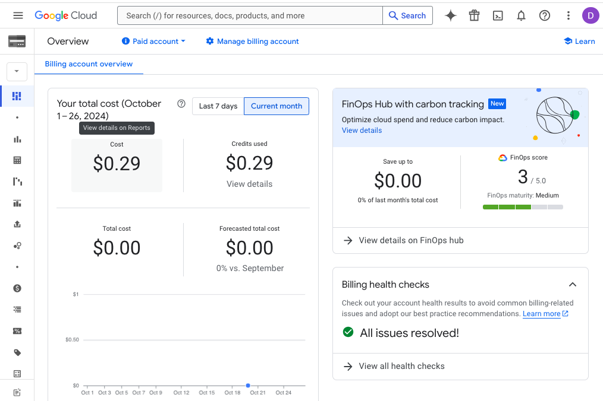
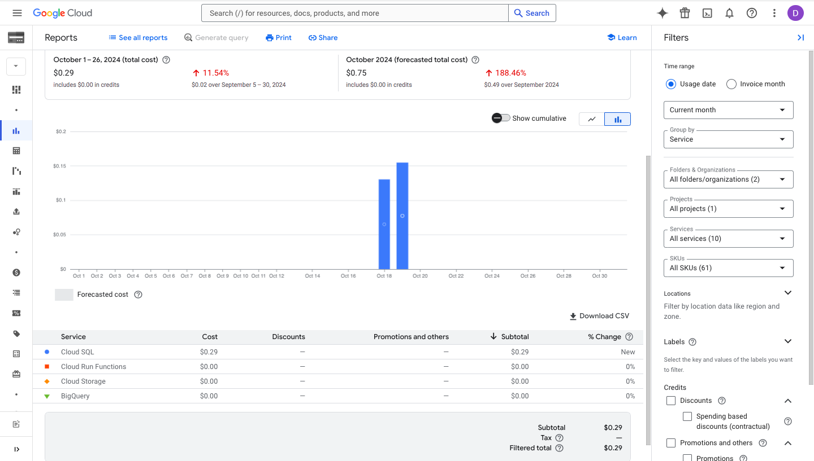
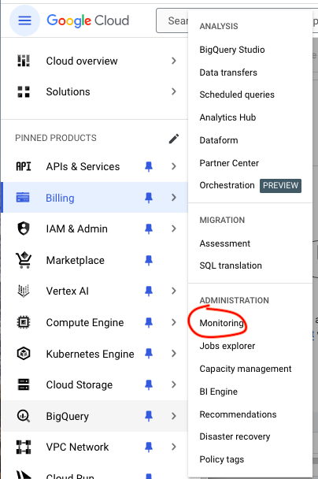
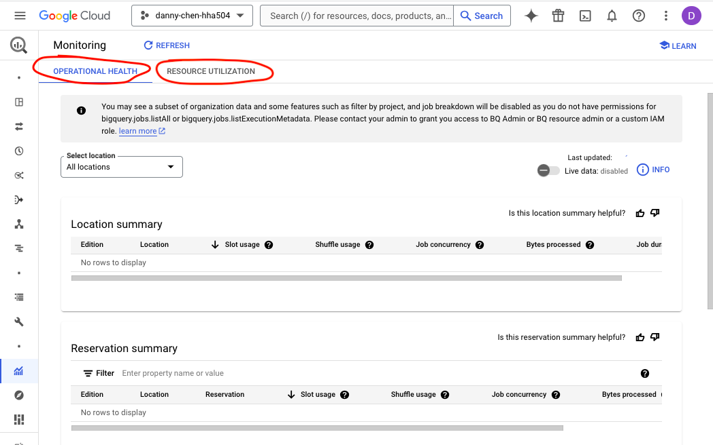

# Working with Managed Databases in Azure and GCP

## Start and Configure a Managed Database
### Azure MySQL
1. Click "Azure Database for MySQL flexible servers"

2. Click "Create," then "Quick Create" a flexible server

3. The following configurations were used:
    * Region: (US) Central US
        * NOTE: In my case, some regions appear to not work like US East and West. One speculation for this is the policy behind how the subscription or resource group was set up.
    * Availability zone: No preference
    * Authentication section --> entered username + password
    * Workload type: Dev/Test
    * Add firewall rule for current IP address: Checked

4. After successfully deploying the server, go to the server
5. On the left panel, click "Settings," then "Databases"

6. Click "Add," add a name for the new database, and then save it to complete the database creation 
 

### GCP MySQL
1. Click the top left burger icon and click "SQL"  

2. Create an instance and "Choose MySQL"

3. The following configurations were used:
    * Choose a Cloud SQL edition: Enterprise
    * Instance Info
        * Edition preset: Sandbox
        * Create an instance ID and password

    * Choose region and zonal availability
        * Zonal Availability: Single zone

    * Customize your instance
        * Machine configuration
            * Machine shapes
                * Shared core
                * 1 vCPU, 0.614 GB (was the smallest one)

        * Storage
            * Storage capacity: 10 GB (was the smallest one)

        * Query insights
            * Enable Query insights: Checked

### Connections Details
#### Azure

#### GCP

## Explore BigQuery (GCP)
1. Click "Big Query" in the top left burger icon  

### Load a small sample dataset into table
2. Click "Add," then "Upload a local file"

    * Select a small csv file to upload
    * Click the "Dataset" box and create a new dataset
        * Add a name for the "Dataset ID"
        * Location Type: Region
    * In the "Table" box, name the table with whatever your data is about
    * Auto detect: Checked

### Run a simple query to obtain specific data
3. After successfully uploading your data file, click "SQL Query"

4. Create a simple query to get desired info from your data
    * This repo used a dataset pertaining to various cereal brands' nutrition
        * [Cereal Nutrition Dataset Link](https://www.kaggle.com/datasets/crawford/80-cereals)
        * Query and results  
   

## Monitor Database Services
### Cost
#### Azure
1. Click the top left burger icon and click "Cost Management + Billing" in the left panel that opens
2. The default "Overview" page shows a dashboard of costs in charts and numbers
    * Based on the pie chart, $0.34 was the incurred cost for running the MySQL flexible server 

#### GCP
1. Click the top left burger icon and click "Billing" in the left panel that opens
2. In the "Overview" page that appears, the cost and credits used will show
3. Hover and click on the "Cost" header area to view the details
    * The cloud SQL instance that was ran for this repo incurred ~$0.11
        * NOTE: After running the instance yesterday on 10/18/2024, the cost was $0.06 in the morning of the following day and increased to $0.11 later that afternoon. Thus, this may not reflect the final cost, as GCP billing updates could take more time.

4. The cost of BigQuery itself can be viewed by...
    1. Click "Reports"
    2. Click the "Services" box
    3. Check "BigQuery"

### Performance
#### Azure
1. Search and click "Azure Database for MySQL flexible servers"
2. Click the created server name
3. On the left panel showing various options, click "Monitoring," then "Metrics"
    * This section shows a chart of one or more metrics
        * The dropdown list under the "Metrics" header allows switching between metrics
        * "Add metric" allows you to view more than one metric simultaneously in the same chart

#### GCP
##### Cloud SQL instance
1. Click the top left burger icon and click "SQL"
2. Click the created SQL instance
3. The default "Overview" page shows a single metric in a chart like CPU utilization, but it can be changed using the dropdown list to view other metrics

    4. A dashboard of various metrics shown at once in charts can be viewed by clicking "System Insights"

    5. Clicking "Query Insights" also provides details on executed queries

##### BigQuery
1. Click "Monitoring" in the sub-panel of "BigQuery" of the left panel

2. Usage related to operational health and resource utilization can be viewed here

### Issues with Monitoring BigQuery Cost and Usage
* BigQuery's cost and usage information has not updated and remains empty in the "Monitoring" section
    * For cost, the [BigQuery](https://cloud.google.com/bigquery/pricing) website mentions that the "first 1 TiB of query data processed per month is free." The queries I ran totaled less than 1 TiB, so this may be why BigQuery's cost did not change. 
    * Troubleshooting Attempts for Usage Information
        * I turned "Live data" on. Then, I ran several queries and refreshed the page after 5 minutes; I repeated this thrice. However, there was no change.
        * I waited the next day, but usage information remains unchanged

## Reflections on Differences in Managing Databases on Azure vs GCP
Making a MySQL database in Azure requires creating a server first unlike GCP where the MySQL instance can be made directly. Creating a database (after the server is made) in Azure is simple in that there is no configurations to adjust; only a name is needed. In contrast, there is more configuration options when creating a database in GCP. GCP seems to allow users to view multiple metrics in a single chart while Azure does not have that option. Azure has a dashboard with various charts that showcase different cost, but they do not have dashboards for performance metrics. GCP is the opposite in that they have a dashboard of performance metrics, but not for cost.
