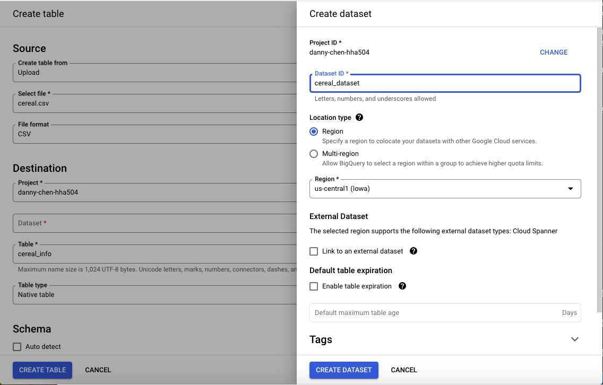

# Working with Managed Databases in Azure and GCP

## Start and Configure a Managed Database
### Azure MySQL (NOTE: successful creation at ~7:10 - NOT STOPPED YET)
1. Click "Azure Database for MySQL flexible servers"

2. Click "Create," then "Quick Create" a flexible server

3. The following configurations were used 
    * Region: (US) Central US
        * NOTE: In my case, some regions appear to not work like US East and West. One speculation for this is the policy behind how the subscription or resource group was set up.
    * Availability zone: No preference
    * Authentication section --> entered username + password
    * Workload type: Dev/Test
    * Add firewall rule for current IP address: Checked

4. After successfully deploying the server, go the server
5. On the left panel, click "Settings," then "Databases"

6. Click "Add," add a name for the new database, and then save it to complete the database creation 
 

### GCP MySQL (NOTE: created at 4:37 PM, finished creating at 4:57; stopped at 10:31 PM):
1. Click the top left burger icon and click "SQL"

2. Create an instance and "Choose MySQL"

3. The following configurations were used:
    * Choose a Cloud SQL edition: Enterprise

    * Instance Info
        * Edition preset: Sandbox
        * Create an instance ID and password

    * Choose region and zonal availability
        * Zonal Availability: Single zone

    * Customize your instance
        * Machine configuration
            * Machine shapes
                * Shared core
                * 1 vCPU, 0.614 GB (was the smallest one)

        * Storage
            * Storage capacity: 10 GB (was the smallest one)

        * Query insights
            * Enable Query insights

## Explore BigQuery (GCP)
1. Click "Big Query" in the top left burger icon

### Load a small sample dataset into table
2. Click "Add," then "Upload a local file"

    * Select a small csv file to upload
    * Click the "Dataset" box and click create a new dataset
        * Name the "Dataset ID"
        * Location Type: Region
        * Create the dataset after
    * In the "Table" box, name the table with whatever your data is about
    * Allow auto-detecting the schema

### Run a simple query to obtain specific data

3. After successfully uploading your data file, click "SQL Query"

4. Create a simple query to get desired info from your data
    * This repo used a dataset pertaining to various cereal brands' nutrition
        * [Cereal Nutrition Dataset Link](https://www.kaggle.com/datasets/crawford/80-cereals)
        * Query and results
   

## Monitor Database Services
### Cost
#### Azure
#### GCP

### Performance
#### Azure
1. Search and click "Azure Database for MySQL flexible servers"
2. Click the created server name
3. On the left panel showing various options, click "Monitoring," then "Metrics"
    * This section shows a chart of one or more metrics
        * The dropdown list under the "Metrics" header allows switching between metrics
        * "Add metric" allows you to view more than one metric simultaneously in the same chart

#### GCP
* Cloud SQL instance
    1. Click the top left burger icon and click "SQL"
    2. Click the created SQL instance
    3. The default "Overview" page shows a single metric in a chart like CPU utilization, but it can be changed using the dropdown list to view other metrics

    4. A dashboard of various metrics shown at once in charts can be viewed by clicking "System Insights"

    5. Clicking "Query Insights" also provides details on executed queries

* BigQuery
    1. Placeholder --> still hasn't loaded, but results section has other tabs that show bytes consumed and all that

